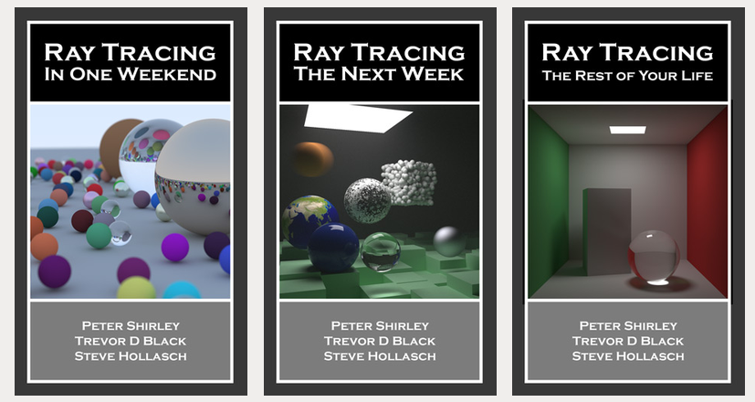
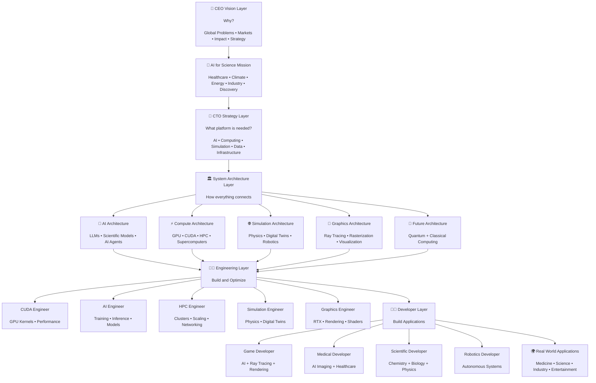

# Real-Time-Rendering

* 👋 I am **Gobal Krishnan V**. I am doing this for learning purposes. 📚
* 💻 I am using the material [RayTracing](https://raytracing.github.io/). It is written in C++, but I am implementing it in **Python** & **JavaScript**. 🚀
* ⚠️ [My device](https://github.com/engineer-e/LLM-Python/blob/main/the_computer_i_used.md) was damaged due to voltage fluctuations. 💥💻 I am using my younger brother's laptop, ["Kishore Kumar V" 💻 Laptop](https://github.com/engineer-e/LLM-Python/blob/main/the_computer_i_using.md). ❤️ [system info](https://github.com/engineer-e/Real-Time-Rendering/blob/main/system_info.txt) ❤️, [gpu info](https://github.com/engineer-e/Real-Time-Rendering/blob/main/gpu_info.txt) ❤️
* 🩺 Due to health issues, I resigned from my job in **June 2025**. 💼 I have been searching for a job for the past **1 year**, but I have not gotten one yet. 🙏

---

 NVIDIA Accelerated Computing Resources: CUDA, Nsight, HPC, Ray Tracing & AI 

# Initial NVIDIA Accelerated Computing Resource Collection

> This is an initial collection of NVIDIA resources organized to explore key GPU computing areas, including CUDA, Nsight tools, HPC, Ray Tracing, and AI acceleration. It serves as a starting point for understanding NVIDIA development workflows, profiling tools, debugging techniques, and performance optimization concepts.

> This is not a complete learning roadmap; additional topics and resources can be added later based on the specific focus area and depth required.

|  |  | | | | |  |
| :---: | :---: | :---: | :---: | :---: | :---: | :---: |
| | | | | | | |

| Area                                          | Resource                                                                                                                                                                             | Description                                                                                                                          |
| --------------------------------------------- | ------------------------------------------------------------------------------------------------------------------------------------------------------------------------------------ | ------------------------------------------------------------------------------------------------------------------------------------ |
| **Nsight Tools**                              | [Nsight Developer Tools](https://resources.nvidia.com/l/en-us-nsight-developer-tools)                                                                                                | Overview of NVIDIA Nsight tools for debugging, profiling, and optimizing CUDA, graphics, and GPU-accelerated applications.           |
| **CUDA**                                      | [Nvidia Dev](https://developer.nvidia.com/downloads)                                                                                                                                 | Install CUDA Toolkit, NVIDIA drivers, SDKs, and GPU development environment required for CUDA programming.                           |
| **CUDA / Nsight**                             | [Tools & Tutorials](https://developer.nvidia.com/tools-tutorials)                                                                                                                    | Learn NVIDIA tools and workflows for CUDA development, debugging, profiling, and optimization.                                       |
| **CUDA Debugging**                            | [Debugging CUDA: An Overview of CUDA Correctness Tools](https://www.nvidia.com/en-us/on-demand/session/gtcspring23-s51772/?playlistId=playList-c9450de5-2ffd-4ea9-8a1b-24aeeaf49d4e) | Learn CUDA correctness tools to detect memory errors, race conditions, synchronization issues, and kernel bugs.                      |
| **CUDA Optimization**                         | [It’s Easier than You Think – Debugging and Optimizing CUDA with Intelligent Developer Tools](https://www.nvidia.com/en-us/on-demand/session/gtc25-s72527/)                          | Learn practical CUDA debugging and optimization techniques using NVIDIA developer tools.                                             |
| **CUDA Performance Analysis**                 | [From the Macro to the Micro: CUDA Developer Tools Find and Fix Problems at Any Scale](https://www.nvidia.com/en-us/on-demand/session/gtc25-s72867/)                                 | Learn how to analyze CUDA problems from application-level bottlenecks to individual kernel performance issues.                       |
| **CUDA Kernel Optimization / Nsight Compute** | [Become Faster in Writing Performant CUDA Kernels using the Source Page in Nsight Compute](https://www.nvidia.com/en-us/on-demand/session/gtcspring23-s51882/)                       | Learn kernel optimization using Nsight Compute, including memory analysis, occupancy, instruction analysis, and performance tuning.  |
| **HPC / Multi-GPU**                           | [Optimizing at Scale: Investigating Hidden Bottlenecks for Multi-Node Workloads](https://www.nvidia.com/en-us/on-demand/session/gtcspring23-s51421/)                                 | Learn how to analyze and optimize large-scale GPU workloads running across multiple GPUs and nodes.                                  |
| **HPC / Communication Profiling**             | [Optimizing Communication with Nsight Systems Network Profiling](https://www.nvidia.com/en-us/on-demand/session/gtcspring22-s41500/)                                                 | Learn to profile communication, networking, synchronization, and data transfer bottlenecks in distributed GPU workloads.             |
| **Ray Tracing / Graphics**                    | [Level Up with NVIDIA: Nsight Graphics - How to Optimize your Game](https://www.nvidia.com/en-us/on-demand/session/other2022-nsightlevelup/)                                         | Learn Nsight Graphics workflows for rendering optimization, shader analysis, frame debugging, and real-time ray tracing performance. |
| **Ray Tracing / Graphics**                    | [Profiling Hybrid CUDA/Graphics Applications using Nsight Graphics](https://www.nvidia.com/en-us/on-demand/session/gtc25-s73224/)                                                    | Learn profiling techniques for CUDA + graphics applications, useful for RTX ray tracing and GPU rendering workloads.                 |
| **AI**                                        | [AI Developer Tools for Accelerated Computing — Scarce Data Isn't Scary!](https://www.nvidia.com/en-us/on-demand/session/gtc25-s72867/)                                              | Learn NVIDIA AI developer tools and accelerated computing workflows for AI applications.                                             |

### Quick Mapping

| Field           | Main Tools / Skills                                                      |
| --------------- | ------------------------------------------------------------------------ |
| **CUDA**        | CUDA C++, kernels, memory management, debugging, optimization            |
| **Nsight**      | Nsight Compute, Nsight Systems, Nsight Graphics, profiling and debugging |
| **HPC**         | Multi-GPU, multi-node workloads, communication optimization, scaling     |
| **Ray Tracing** | RTX, graphics pipeline, shaders, rendering optimization                  |
| **AI**          | GPU acceleration, AI workloads, inference/training optimization          |

This structure removes duplicates and places each session where it is most useful.

---

[**👤 Which person connects all these fields and understands them together? Please explain it properly.**](question/1.md)

---

[**🎥 Is there any YouTube video or course that explains the complete picture in a single video?**](question/2.md)

---

[**🚀 I need a proper explanation from someone who combines all these areas and explains them in an interesting way. Is there any YouTube channel or NVIDIA session that covers this?**](question/3.md)

---

 
 

1. Ray Tracing in One Weekend -  [Python](Ray%20Tracing%20in%20One%20Weekend%20-%20Python/ray_tracing_in_one_weekend.md),  [Javascript](Ray%20Tracing%20in%20One%20Weekend%20-%20Javascript/readme.md), [cpp](Ray%20Tracing%20in%20One%20Weekend%20-%20Cpp/readme.md)
2. Ray Tracing: The Next Week - Python, [Javascript](Ray%20Tracing%20next%20Week%20-%20Javascript/readme.md)
3. Ray Tracing: The Rest of Your Life

---

🧠 NVIDIA Accelerated Computing Stack: From Business Vision to Technology Execution 

# 🧠 NVIDIA Accelerated Computing Stack: From Business Vision to Technology Execution

* **CEO** → Why are we building this? Business value, strategy, human impact.
* **CTO** → What technology platform is needed? Architecture and long-term technical direction.
* **System Architect** → How do all components connect together?
* **Engineer** → How do we build and optimize the systems?
* **Developer** → How do we write applications using the platform?

A complete view should look like this:

## How each layer thinks:

| Role            | Main Question                      | Focus                               |
| --------------- | ---------------------------------- | ----------------------------------- |
| 👔 CEO          | "Why does this matter?"            | Vision, business, impact, market    |
| 🎯 CTO          | "What technology strategy wins?"   | Platforms, ecosystem, investment    |
| 🏛 Architect    | "How do all systems connect?"      | Design, interfaces, scalability     |
| 👨‍🔬 Engineer  | "How do we build and optimize it?" | CUDA, AI, HPC, simulation, graphics |
| 👨‍💻 Developer | "How do users create products?"    | Applications, software, experiences |

## Example: AI + Ray Tracing + Medical Simulation

**CEO thought:**

> "Can we improve healthcare and reduce discovery time?"

↓

**CTO thought:**

> "We need AI, GPUs, simulation, and visualization platforms."

↓

**Architect thought:**

> "Connect AI models, CUDA, HPC, Omniverse, RTX, and medical data."

↓

**Engineer thought:**

> "Optimize GPU workloads, physics simulation, rendering, and AI inference."

↓

**Developer thought:**

> "Build the medical simulator, diagnostic tool, or application."

This is the complete hierarchy from **vision → architecture → engineering → product**.

---